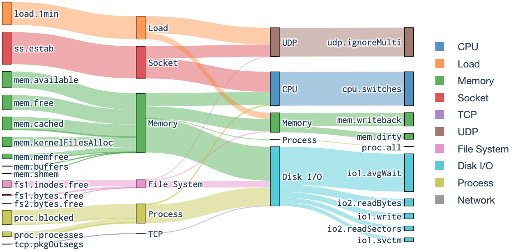
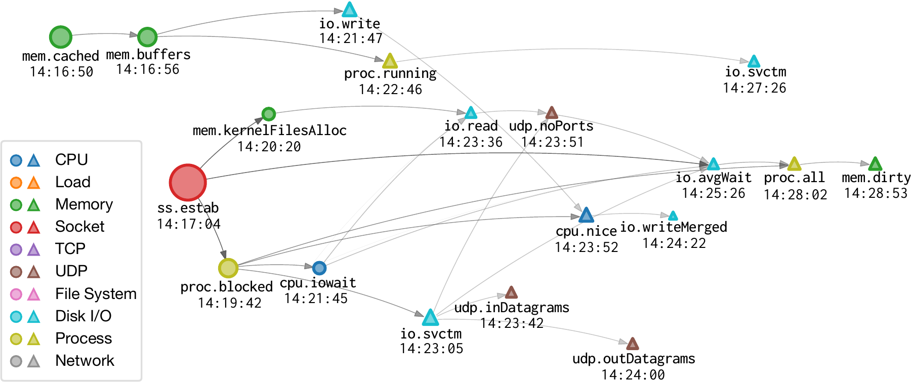

# 🔍 FaultInsight

### Interpreting Hyperscale Data Center Host Faults

**KDD 2024**  
[Paper](https://doi.org/10.1145/3637528.3672051) · [Implementation](main.py) · [Sample case](dataset_config.yaml)

FaultInsight explains how a host fault develops across **heterogeneous performance metrics** such as socket connections, memory, CPU, load and disk I/O. It learns temporal dependencies, measures changing causal influence, and presents the resulting diagnosis at metric, component and propagation-path levels. The paper evaluates the method on production data-center incidents.

This repository contains the research implementation and **one sample host-fault case**.

[Incident demo](#demo-interpreting-a-real-host-incident) · [Included files](#what-is-included) · [Setup](#prepare-the-released-training-entry-point) · [Citation](#citation)

## Demo: interpreting a real host incident



**Paper Figure 8.** The Sankey diagram summarizes the running incident at component level. Metrics and components on the left contribute anomalous outward influence; those on the right receive it. In this case, sockets, memory, load and processes propagate influence toward disk I/O and CPU, helping distinguish a downstream storage symptom from the initiating problem.

### Following the propagation over time



**Paper Figure 9.** Each node is a metric, annotated with its peak propagation timestamp. The network aligns inferred impact paths chronologically, making the evolution from early connection/memory anomalies to later I/O symptoms visible.

The paper's three diagnostic views answer different questions:

| View | Diagnostic question |
| --- | --- |
| Metric-level graph | Which metrics propagate or receive the strongest anomalous influence? |
| Component-level flow diagram | How do anomalies connect different host subsystems? |
| Time-aligned propagation network | In what temporal order do the inferred impact paths develop? |

The figures above are experimental outputs from the paper. The setup section describes the current public script's execution requirements.

## What is included

| File | Content |
| --- | --- |
| `main.py` | VARP/TCN model, training, perturbation analysis and ranking functions |
| `requirements.txt` | Pinned research-environment dependencies, including PyTorch 1.13.1 and tsai 0.3.4 |
| `dataset_config.yaml` | Sample file name, incident time range and ground-truth root-cause metric |
| `data/faultinsight_sample_data.parquet` | The released sample host-metric data |
| `assets/component-influence.png` | Paper Figure 8: component-level influence flows |
| `assets/temporal-propagation.png` | Paper Figure 9: time-aligned propagation network |

The sample configuration identifies an incident from **2022-04-13 14:15 to 14:45**, with **`[runtime]ssEstab`** as the reference root-cause metric. That annotation is ground truth supplied with the sample, not a prediction produced by the README.

## Prepare the released training entry point

Use an environment compatible with the pinned dependencies. The requirements include CUDA libraries and the script defaults to **`cuda:0`**. The default experiment trains ten random seeds for up to 2,000 joint epochs per seed; this is a research experiment, not a short demo.

```bash
python -m pip install -r requirements.txt
```

The current script reads `../data_config.yaml` and `../data/<case_name>.parquet` relative to the working directory. The following setup aligns those paths without modifying source code. **Execution still requires supplying or adapting `preprocess_df`, which is referenced but not defined or imported in this release.**

```bash
# From the repository root:
cp dataset_config.yaml data_config.yaml
mkdir -p work
cd work
python ../main.py
```

Once the missing preprocessing step is supplied, training is configured to write artifacts to `runs/kdd_2024/` under the repository root, including `main.log`, per-case/per-seed model checkpoints and validation-loss arrays. The `graphs/` and `results/` directories are created, but the current main loop does not populate diagnostic outputs because the downstream stages are commented out.

## Using your own cases

Place each case at `data/<case_name>.parquet`, with the case name matching the YAML key. Each configured root-cause metric must match a column name in the data. Adapt the sample configuration, then update the `data_config.yaml` alias used by the script.

```yaml
faultinsight_sample_data:
  time_range:
    start: "2022-04-13 14:15"
    end: "2022-04-13 14:45"
  root_causes:
    - "[runtime]ssEstab"
```

The temporal encoder/decoder and dependency matrix are defined by `VARP`. The script contains `extract_causal_graph` and `pagerank_rca` functions for downstream analysis. Enabling a complete diagnosis run requires adapting the commented orchestration and checking its function signatures and data assumptions; simply uncommenting those blocks is not a verified reproduction path.

## Citation

```bibtex
@inproceedings{bi2024faultinsight,
  title={FaultInsight: Interpreting Hyperscale Data Center Host Faults},
  author={Bi, Tingzhu and Zhang, Yang and Pan, Yicheng and Zhang, Yu and Ma, Meng and Jiang, Xinrui and Han, Linlin and Wang, Feng and Liu, Xian and Wang, Ping},
  booktitle={Proceedings of the 30th ACM SIGKDD Conference on Knowledge Discovery and Data Mining},
  pages={141--152},
  year={2024},
  doi={10.1145/3637528.3672051}
}
```
